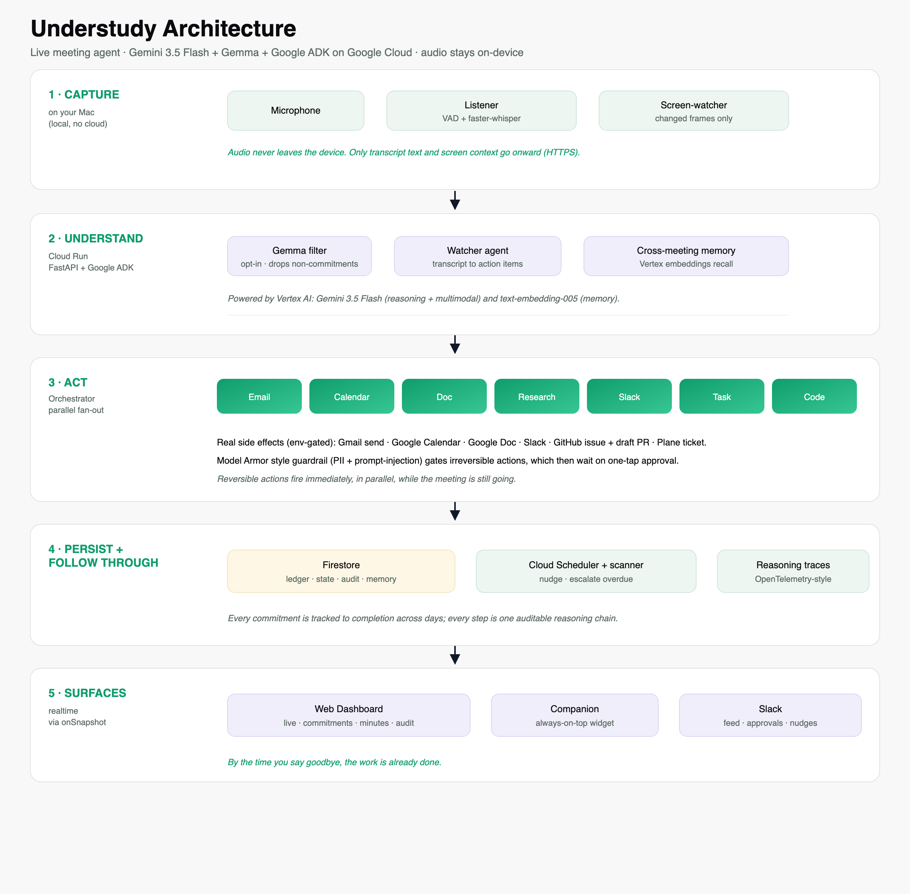

# Understudy

**A live meeting agent that does the work while you talk, and keeps chasing it until it's done.**

Understudy listens to a meeting in real time, extracts action items as they're spoken, and autonomously executes everything it safely can *in parallel while the meeting is still going*: drafting emails, writing docs, booking reviews, filing tickets, opening pull requests, and posting to Slack. Irreversible actions (like sending an email or merging a PR) wait for one-tap approval. After the meeting it doesn't stop: it tracks every commitment to completion across days, nudges the owners, escalates what stalls, and remembers context across meetings.

Built for the **All Things Agentic Hackathon** on **Gemini 3.5 Flash + Google ADK + Google Cloud**.

**Live deployment**

- Hosted app: https://understudy-web-259946930410.asia-south1.run.app
- Agent backend: https://understudy-agent-259946930410.asia-south1.run.app

The hosted dashboard is a **live** view of the deployed system (real Firestore, real backend, real GitHub/Plane/Slack actions, one-tap approvals). It comes pre-populated with a demo meeting so you can explore immediately.

### Transcribe your own voice into the hosted dashboard

A browser cannot access your microphone for our on-device transcriber, so live capture runs from a small local listener. Audio never leaves your machine; only the derived transcript text is sent onward. To drive the hosted dashboard with your own speech:

```bash
git clone https://github.com/Re1ner15/understudy && cd understudy
brew install portaudio                                            # mic support (macOS)
python3.11 -m venv venv && source venv/bin/activate
pip install -r requirements.txt

# Point the local listener at the HOSTED backend and the demo meeting:
MEETING_ID=demo-meeting \
AGENT_SERVER_URL=https://understudy-agent-259946930410.asia-south1.run.app \
AUDIO_DEVICE="MacBook Pro Microphone" \
python listener/listen.py --manual
```

Then open the hosted app, click **Record**, and start talking (try: "I'll email the team a recap, and let's book a design review for Thursday"). Your words appear in the transcript and Understudy acts on them live. Click **Pause** to stop, **Conclude meeting** to generate minutes. Prefer to run everything locally instead? See "Run the live pipeline (with a mic)" below.

---

## Architecture



- **Local (on-device):** a Python **listener** captures the mic, segments speech with VAD, and transcribes locally with **faster-whisper**. Audio never leaves the device; only derived transcript text is sent onward. An opt-in **screen-watcher** sends only changed, downscaled frames to Gemini for multimodal understanding of slides, docs, and sites.
- **Cloud Run, agent backend (FastAPI + Google ADK):** transcript text hits the server, a cheap **Gemma** first-pass filter drops non-commitments, a **watcher** agent turns the rest into structured action items, **cross-meeting memory** (Vertex embeddings) attaches related past context, and an **orchestrator** fans the items out to **tool agents** that run concurrently. Every reasoning and generation step is **Gemini 3.5 Flash via Vertex AI**.
- **Tool agents:** email, calendar, doc, research, slack, task, and code. Real side effects (env-gated): Gmail draft/send, Google Calendar event, Google Doc, Slack post/DM, a **Plane** work item that advances Todo to In Progress to Done, and a **GitHub** issue plus a draft pull request carrying the actual code diff.
- **Safety + observability:** a **Model Armor style guardrail** scans drafted content for PII and detects prompt-injection in the transcript before any irreversible action; **OpenTelemetry-style reasoning traces** link every step into one auditable chain.
- **Firestore:** the commitment ledger + live meeting state. All surfaces read it in real time via `onSnapshot`.
- **Cloud Scheduler, follow-up scanner:** periodically finds overdue/open commitments and nudges owners in Slack.
- **Surfaces:** a **web dashboard** (live meeting view, commitments board, minutes, reasoning-trace audit), a floating **companion** widget for use during the meeting, and **Slack** (feed, approvals, clarifications, nudges).

---

## Tech stack

| Layer | Choice |
|---|---|
| Reasoning model | Gemini 3.5 Flash (Vertex AI, or Gemini API for local dev) |
| Additional models | Gemma (first-pass filter), Vertex AI `text-embedding-005` (cross-meeting memory) |
| Agent framework | Google ADK (`google-adk`) + Google GenAI SDK (`google-genai`) |
| Agent server | FastAPI + Uvicorn |
| Transcription | faster-whisper + webrtcvad + sounddevice (local, on-device) |
| Screen understanding | mss + Pillow + imagehash (changed-frame capture) |
| State / realtime | Firestore (`google-cloud-firestore`) |
| Compute / deploy | Cloud Run (+ Cloud Build, Artifact Registry) |
| Follow-up automation | Cloud Scheduler |
| Real integrations | Gmail / Calendar / Docs (OAuth), GitHub (REST/GraphQL), Plane (REST), Slack (Bolt) |
| Frontend | Vite + React + TypeScript |
| Companion window | Electron |

---

## Repo layout

```
understudy/
├── understudy_agent/          # ADK + FastAPI backend (the agent)
│   ├── server.py              # FastAPI: meeting lifecycle + pipeline orchestration
│   ├── watcher.py             # transcript -> action items (LlmAgent + output_schema)
│   ├── orchestrator.py        # parallel fan-out to tool handlers
│   ├── tools/                 # gemini_json helper + per-category handlers
│   ├── gemma_filter.py        # Gemma first-pass "is this a commitment?" filter
│   ├── memory.py              # cross-meeting semantic memory (Vertex embeddings)
│   ├── guardrail.py           # Model Armor style PII + prompt-injection guard
│   ├── tracing.py             # OpenTelemetry-style reasoning-chain spans
│   ├── minutes.py             # meeting minutes (incl. what was shown on screen)
│   ├── screen_analyzer.py     # multimodal screen-context understanding
│   ├── scanner.py             # follow-up scanner (nudge/escalate)
│   ├── google_delivery.py     # real Gmail / Calendar / Docs (OAuth)
│   ├── github_delivery.py     # real GitHub issue + draft PR
│   ├── plane_delivery.py      # real Plane work items + state transitions
│   ├── slack_app.py           # Slack feed, approvals, clarifications, nudges
│   ├── ledger.py              # Firestore commitment ledger + meeting state
│   ├── schemas.py             # Pydantic models
│   └── config.py              # MODEL_ID = "gemini-3.5-flash"
├── listener/                  # local mic -> VAD -> whisper -> transcript; + screen_watcher
├── scripts/                   # test_* scripts, run_server.py, seed_*.py, google_auth.py
├── web/                       # React dashboard + companion (Vite)
│   └── src/data/              # store.ts (mock) | firestore.ts (live) | api.ts (server calls)
├── desktop/                   # Electron shell for the floating companion
├── deploy/                    # Dockerfile helpers, deploy.sh, scheduler.sh
├── docs/                      # architecture diagram, demo storyboard, submission text
└── requirements.txt
```

---

## Prerequisites

- **Python 3.11+** and **Node 18+**
- **Java 11+** (the Firestore emulator is a Java program), e.g. `brew install openjdk`
- **PortAudio** (for the mic listener), `brew install portaudio`
- A **Gemini API key** ([AI Studio](https://aistudio.google.com)) for local dev, or a Google Cloud project with Vertex AI for production
- **firebase-tools** (installed as a dev dependency in `web/`)

---

## Reproducible testing (zero cost, no billing)

The whole pipeline runs deterministically with **no model calls** via `MOCK_AGENT=1` against the local Firestore emulator. This is the fastest way to verify the system end to end.

```bash
# 0. one-time
python3.11 -m venv venv && source venv/bin/activate
pip install -r requirements.txt
cd web && npm install && cd ..
cp understudy_agent/.env.example understudy_agent/.env   # fill GOOGLE_API_KEY for live runs

# 1. Firestore emulator (leave running); Java must be on PATH
cd web && npm run emulator     # Firestore :8080, UI :4000
# 2. seed demo data (new shell, repo root, venv active)
PYTHONPATH=. FIRESTORE_EMULATOR_HOST=127.0.0.1:8080 GOOGLE_CLOUD_PROJECT=demo-understudy \
  python scripts/seed_firestore.py
# 3. agent server in mock mode (new shell)
MOCK_AGENT=1 FIRESTORE_EMULATOR_HOST=127.0.0.1:8080 PYTHONPATH=. python scripts/run_server.py
# 4. drive the demo meeting through the server and assert Firestore gets the actions
PYTHONPATH=. python scripts/test_pipeline.py
# 5. watch it live
cd web && npm run dev:firestore   # open http://localhost:5173/meeting
```

Unit / component tests (each runs standalone, most are mock/emulator based):

```bash
PYTHONPATH=. python scripts/test_watcher.py            # transcript -> action items (needs API quota)
PYTHONPATH=. python scripts/test_orchestrator.py       # watcher -> parallel tools on demo_meeting.txt
PYTHONPATH=. python scripts/test_orchestrator.py --mock # fixed batch, no watcher
PYTHONPATH=. python scripts/test_guardrail.py          # PII + prompt-injection detection (rules)
PYTHONPATH=. python scripts/test_gemma_filter.py       # first-pass commitment filter
PYTHONPATH=. python scripts/test_tracing.py            # reasoning-chain spans in Firestore
PYTHONPATH=. python scripts/test_ui_backend_integration.py  # UI actions -> server endpoints
```

---

## Run the live pipeline (with a mic)

```bash
# backend (live Gemini). Point the listener at it via AGENT_SERVER_URL.
FIRESTORE_EMULATOR_HOST=127.0.0.1:8080 PYTHONPATH=. python scripts/run_server.py

# listener: auto-detects a meeting (or sustained speech), transcribes on-device, POSTs utterances
AGENT_SERVER_URL=http://localhost:8000 AUDIO_DEVICE="MacBook Pro Microphone" python listener/listen.py
```

Open `http://localhost:5173/meeting`, `/commitments`, `/minutes`, `/audit`, and `/companion`.

---

## Real integrations (optional, env-gated)

All default to safe mock/draft mode. Turn on real delivery per integration:

| Integration | Enable | Extra config |
|---|---|---|
| Gmail / Calendar / Docs | `GOOGLE_WORKSPACE_ENABLED=true` | run `python scripts/google_auth.py` once (drops `token.json`); needs `client_secret.json` |
| GitHub issue + draft PR | `GITHUB_ENABLED=true` | `GITHUB_TOKEN`, `GITHUB_REPO=owner/name`, optional `GITHUB_TARGET_FILE` |
| Plane work items | `PLANE_ENABLED=true` | `PLANE_API_KEY`, `PLANE_WORKSPACE`, `PLANE_PROJECT` |
| Slack | set tokens | `SLACK_BOT_TOKEN`, `SLACK_APP_TOKEN`, `SLACK_SIGNING_SECRET` |

`token.json`, `client_secret.json`, and every `.env` are gitignored. Never commit them.

---

## Deploy (Google Cloud)

```bash
# 1. Point the model backend at Vertex (understudy_agent/.env):
#    GOOGLE_GENAI_USE_VERTEXAI=TRUE, GOOGLE_CLOUD_PROJECT=<id>, GOOGLE_CLOUD_LOCATION=global
gcloud auth application-default login
gcloud services enable aiplatform.googleapis.com firestore.googleapis.com run.googleapis.com \
  cloudbuild.googleapis.com artifactregistry.googleapis.com cloudscheduler.googleapis.com

# 2. Provision Firestore (Native mode, region asia-south1); set USE_REAL_FIRESTORE=true.
# 3. Build + deploy the agent backend and the web frontend to Cloud Run:
bash deploy/deploy.sh          # parameterized by $PROJECT_ID and $REGION (default asia-south1)
# 4. Schedule the follow-up scanner:
bash deploy/scheduler.sh       # Cloud Scheduler POSTs /scan on a cron
```

---

## Configuration (environment variables)

| Var | Where | Purpose |
|---|---|---|
| `GOOGLE_GENAI_USE_VERTEXAI` | `understudy_agent/.env` | `FALSE` = Gemini API key (dev), `TRUE` = Vertex (prod) |
| `GOOGLE_API_KEY` | `understudy_agent/.env` | Gemini API key for local dev |
| `GOOGLE_CLOUD_PROJECT` / `GOOGLE_CLOUD_LOCATION` | `understudy_agent/.env` | Vertex project + location (`global`) |
| `MOCK_AGENT` | server | `1` = run the whole pipeline with zero model calls |
| `FIRESTORE_EMULATOR_HOST` | shell | `127.0.0.1:8080` to target the local emulator |
| `AGENT_SERVER_URL` | listener | where the listener POSTs utterances |
| `AUDIO_DEVICE` | listener | input device name substring |
| `ALLOWED_ORIGINS` | server | CORS origins for the dashboard |
| `VITE_DATA_SOURCE` / `VITE_USE_EMULATOR` | `web/` | `mock`/`firestore`, emulator on/off |
| `SLACK_BOT_TOKEN` / `SLACK_APP_TOKEN` / `SLACK_SIGNING_SECRET` | `.env` | Slack |

---

## Firestore data model

```
meetings/{meetingId}                        { title, date, status, startedAt }
meetings/{meetingId}/transcript/{lineId}    { id, speaker, text, ts, isLive }
meetings/{meetingId}/actions/{actionId}     { id, itemId, category, title, assignee, status,
                                              reasoning, artifact, requiresApproval, guardrail, relatedMemory }
meetings/{meetingId}/screenContext/{id}     { kind, summary, ts }
meetings/{meetingId}/minutes/latest         { title, date, attendees, topics, decisions, materials, actionItems }
meetings/{meetingId}/clarifications/{id}    { question, status, answer, actionItem }
meetings/{meetingId}/audit/{spanId}         { traceId, spanId, parentId, name, startTs, endTs, status, attributes }
commitments/{commitmentId}                  { id, title, category, assignee, sourceMeeting, sourceDate, due,
                                              status, followUp: { nudgeCount, lastNudge, nextNudge, note, actionType }, artifact }
memory/{docId}                              { meetingId, title, date, text, kind, embedding }
```

---

## Privacy

There is no bot that joins your call. Audio is transcribed on-device and discarded; only text is sent onward. Screen capture is opt-in, permission-gated, downscaled, and only changed frames are sent. Irreversible actions always wait for explicit human approval.
